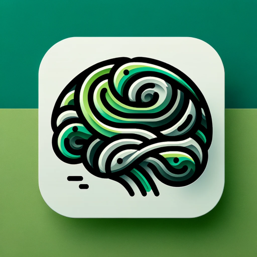

<p align="center">
  
  <h1 align="center">PersonaFlow</h1>
  <h2 align="center"><b><i>Where AI Meets Individuality for Unmatched Personalization</i></b></h2>
</p>

<p align="center">
  <a href="https://discord.gg/zqHHYGuHFd"> 
    
  </a>
</p>

**The PersonaFlow platform aims to provide highly personalized user experiences fueled by Generative AI. With a focus on scalability and efficiency, PersonaFlow offers a suite of tools and APIs to create complex agents and high-performing retrieval augmented generation (RAG) systems driven by _personas_ and with a focus on:**

- Context optimization
  - Intelligent partitioning of ingested data
  - Personalized decision-making based on multiple data vectors
  - Dynamically adjusting retrieval and generation parameters based on user information
- Enterprise feasibility: scalability, cost efficiency, and privacy
- Agent development, testing, and evaluation via the PersonaFlow administration tool
- Easy integration of generative AI features into applications via the PersonaFlow client SDKs

This repo is the orchestration server for the PersonaFlow platform. It is a REST API that allows you to create and manage agentic assistants, run the agents against various LLMs, create and save user-specific chat threads, and more.

Much of the API and business language is modeled after the OpenAI Assistants API and uses LangChain as the primary orchestration framework. The assistants implementation began from an early iteration of OpenGPTs, which was then refactored and expanded with additional infrastructure, agent options, file management, an improved and highly configurable RAG system, and a suite of agent-based features. It will be further expanded with personalization features, additional RAG optimization techniques, and more.

 <p align="center" style="color:green"><b><i>Note: This project is in the very early stages of development and testing. Breaking changes should therefore be expected until the first stable release.</i></b></p>

> Web site and documentation are in the works, but in the meantime you can find the API documentation [on SwaggerHub](https://app.swaggerhub.com/apis-docs/DanOrlando/personaflow/0.1.0).

# Roadmap

- [x] Assistants API
- [x] File management
- [x] Advanced RAG with adaptive chunking and summarization
- [x] Advanced RAG assistants integration
- [x] More LLMs, embedding options
- [x] Local LLMs and embeddings (Ollama, Huggingface)
- [ ] Auth
- [ ] Admin client (in progress)
- [ ] More agent types (self-reflection, etc.)
- [ ] Persona generation
- [ ] PersonaGen integration
- [ ] Evaluation and scoring of assistants and RAG configurations
- [ ] TypeScript SDK
- [ ] Python SDK

# Technology Stack

- Programming Language: Python
- Relational Database: PostgreSQL
- Vector Database: Qdrant (more will be supported)
- ORM: SQLAlchemy
- Migration Tool: Alembic
- Orchestration: LangChain
- Agentic Assistants: LangGraph
- Document Processing: Semantic-Router, Unstructured
- Frontend: TypeScript/React 
- Mono-repo manager: Pants

# Setup

The application can be setup to run locally for development, within Docker via the provided docker-compose.yaml, or a Kubernetes cluster.

## Quickstart (Docker)

Follow these instructions if you are only running from Docker and do not need to set up the environment for development.

1. Create .env.production file in root using the .env.production.example template.
2. Run `docker-compose up`

## Dev Setup

_Builds and dependencies are managed by [Pantsbuild](https://www.pantsbuild.org/2.20/docs/python/overview). Pants is a fast, scalable, user-friendly rust-based build system._


1. [install Pants](https://www.pantsbuild.org/2.20/docs/getting-started/installing-pants) on your system.
2. Clone the repo and make sure you have Python 3.11.* installed and the interpreter selected in your IDE.
3. Create .env and .env.production files using the .env.example and .env.production.example templates.
4. Open docker-compose.yaml and comment out the `stack` block under `services` if it is not already commented out.
5. Open docker on your machine if it is not already running and run `docker-compose up -d`. This will download and start the images for Qdrant, Postgres, and Unstructured-API
6. Install dependencies by running `poetry install --no-root`. 
7.  When that is fiinished, run the database migration with `alembic upgrade head`.
8.  Run `pants run stack:local` to start the server. Include the `--loop` flag to auto-reload the server on changes.
9. Navigate to `http://localhost:9000/docs` to see the API documentation.

## Useful Pants Commands
- Format: `pants fmt ::`
- Test: `pants test ::`
- Run PersonaStack locally: `pants run stack:local`
- Run PersonaStack with auto-reload and "debug" logging: `pants run stack:local --loop --ldebug`

Note: `::` means all files in project. For more information on targeting, see: [Targets and BUILD files](https://www.pantsbuild.org/2.20/docs/using-pants/key-concepts/targets-and-build-files).

>_Pants uses a constraints.txt as the lock file for dependencies, which is exported from the from poetry.lock. If you add a new dependency, you will need to run `poetry lock` to update the poetry.lock, followed by `poetry export --format constraints.txt --output constraints.txt` to regenerate the constraints file which will lock the new dependency to the version in the poetry.lock file._

# API Usage

To run the APIs by themseleves, you can use the Swagger UI at `http://localhost:9000/docs` or import the openapi json file into Postman.

## Document Processing

Currently there are 2 systems of document processing. The `/api/v1/rag/assistants/ingest` endpoint ingests document uploads where the name of the collection that is created is the `assistant_id`, which is then used as a retrieval tool for the respective assistant.

The `/api/v1/rag/ingest` and `/api/v1/rag/query` exist as standalone endpoints for document processing. These endpoints only support embeddings generated by OpenAI and Cohere at the moment, with support for Azure OpenAI, Huggingface embeddings, and Ollama for local embedding models soon to come.

For the standalone endpoints, processing of unstructured data is handled primarily by the [embedding service](./stack/app/rag/embedding_service.py), which does the partioning, chunking, embedding, and upserting of documents. The splitting of documents can be done by title, where the title elements of the document are detected and then split accordingly, or the splits can be created according to semantic similarity of the surrounding content. The embeddings are then stored in the Qdrant vector database. Note that other vector database options will be added soon.

The `/api/v1/rag/ingest` endpoint supports the ingesting of documents that are uploaded with the request, or provided as a list of file objects containing URLs. This means that you could create a single collection that contains data from a combination of local files and web content.

> Note: Currently, a major limitation is that html pages have to end in .html to be processed. Mitigating this limitation is a top priority.

There are a number of configuration options available for the ingestion process, provided as a multipart form data JSON string called `payload` along with any files to be ingested if uploading.

**/rag/ingest `payload`**:

```json
{
  "index_name": "UnstructuredDocs",
  "vector_database": {
    "type": "qdrant",
    "config": {
      "host": "http://localhost:6333",
      "api_key": "123456789"
    }
  },
  "document_processor": {
    "summarize": true,
    "encoder": {
      "dimensions": 1536,
      "encoder_model": "text-embedding-3-small",
      "provider": "openai"
    },
    "unstructured": {
      "hi_res_model_name": "detectron2_onnx",
      "partition_strategy": "auto",
      "process_tables": false
    },
    "splitter": {
      "max_tokens": 1000,
      "min_tokens": 30,
      "name": "semantic",
      "prefix_summary": true,
      "prefix_titles": true,
      "rolling_window_size": 1
    }
  },
  "files": [
    {
      "url": "https://unstructured-io.github.io/unstructured/core/chunking.html",
      "name": "Chunking"
    }
    {
      "url": "https://unstructured-io.github.io/unstructured/core/partition.html",
      "name": "Partition"
    }
    {
      "url": "https://unstructured-io.github.io/unstructured/core/extracting.html",
      "name": "Extracting"
    }
  ],
  "webhook_url": "http://localhost:5000/webhook"
}

```

**Notes**

- `vector_database`: This block is optional but is useful when collections are held across different vector databases. If omitted, these details will be obtained from environment variables.
- `summarize`: If true, a separate vector store will be created containing summaries of the documents. If the query involves providing a summary, the corresponding summary collection will be queried instead of the main collection.
- `webhook_url`: This is an optional webhook that will be called when the ingestion has completed.

## Querying

Document retrieval can be done directly by calling the `/api/v1/rag/query` endpoint. This is a POST request with a JSON payload containing the query parameters. Here is an example of a query payload:

```json
{
  "input": "datasets used in experiments",
  "vector_database": {
    "type": "qdrant",
    "config": {
      "host": "http://localhost:6333",
      "api_key": "123456789"
    }
  },
  "index_name": "LLMLingua",
  "encoder": {
    "provider": "cohere",
    "encoder_model": "embed-multilingual-light-v3.0",
    "dimensions": 384
  },
  "thread_id": "1924572b-042c-4725-b378-7e8c6664dc81",
  "interpreter_mode": false,
  "exclude_fields": [],
  "enable_rerank": true
}
```

**Notes**

- `vector_database`: This block is optional but is useful when collections are held across different vector databases. If omitted, these details will be obtained from environment variables.
- `thread_id`: This is an optional parameter and can be used to tie the query to an existing conversation id for logging purposes.
- `enable_rerank`: Whether or not to rerank the query results. Currently requires a cohere api key if true (local reranking is not yet implemented).

# Troubleshooting 
Q. When I try to run `docker-compose up` I get the error: "configs.qdrant_config Additional property content is not allowed"
A. Proving the inline content in the configs top-level element requires Docker Compose v2.23.1 or above. This functionality is supported starting Docker Engine v25.0.0 and Docker Desktop v4.26.0 onwards.

# Contributing

Contributions are welcome! If you have a feature request, bug report, or a pull request, please feel free to open an issue or submit a PR.

# 📝 License

This project is licensed under the MIT License - see the [LICENSE](LICENSE) file for details.
